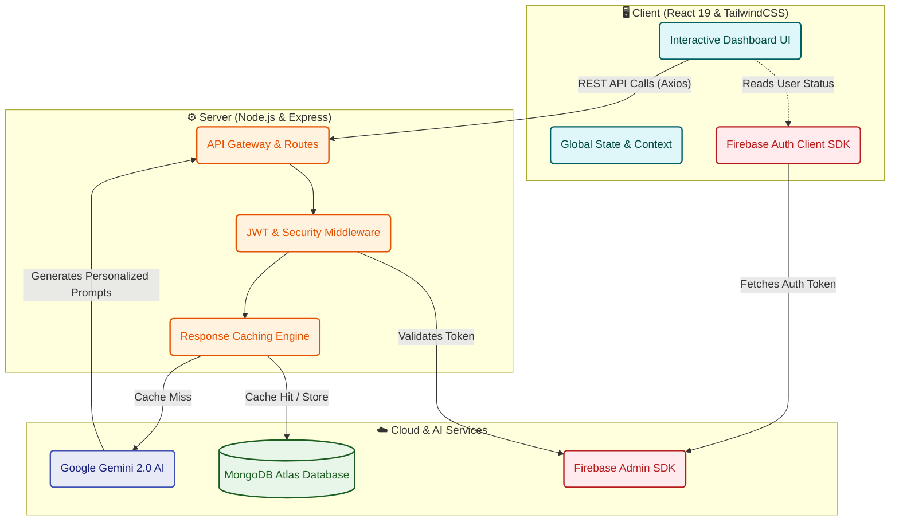

<p align="center">
  
</p>

<h1 align="center">🗳️ VotePath AI</h1>
<h3 align="center">Personalized Election Journey Assistant</h3>

<p align="center">
  <em>An AI-powered civic technology platform that democratizes the Indian election process by providing personalized, step-by-step guidance powered by Google Gemini.</em>
</p>

<p align="center">
  
  
  
  
  
</p>

---

## 🚨 The Problem

India is the world's largest democracy with over **950 million registered voters**, yet millions miss their opportunity to vote in every election. Why?

1. **Information Overload:** Voters are forced to navigate fragmented, dense, and confusing bureaucratic guidelines.
2. **Lack of Personalization:** A 19-year-old first-time voter in rural Maharashtra has fundamentally different needs and steps than a 45-year-old registered voter in urban Delhi. Current systems treat them identically.
3. **Language Barriers:** Critical voting procedures are often locked behind complex language and poor translation.

> [!WARNING]
> Without clear, personalized, and accessible guidance, the democratic process becomes intimidating, leading to lower voter turnout and disenfranchisement.

---

## 💡 Why This Solution Matters

**VotePath AI** transforms the voting experience from a confusing bureaucratic maze into a **clear, personalized journey**. 

By leveraging **Google Gemini 2.0 Flash**, we eliminate the noise. Instead of showing a voter a 50-page PDF on election rules, we profile the user and use AI to generate the exact 5 steps *they* need to take to cast their ballot successfully. 

### 🌍 Real-World Impact
- **Increased Turnout:** By removing friction, more citizens successfully navigate registration and voting.
- **Civic Education:** Interactive quizzes and AI-driven scenario simulations educate voters on their rights and the democratic process.
- **Accessibility:** Bilingual support (English/Hindi) ensures that critical information reaches a wider demographic.

---

## 🚀 Innovation Points

VotePath AI isn't just an FAQ wrapper; it's a dynamic, context-aware engine.

- **Dynamic Voter Profiling:** The system adapts its UI and AI prompts based on real-time user data (Age, State, Voter Status).
- **Generative "What-If" Scenarios:** Instead of static error pages, our AI simulates real-world problems (e.g., "I lost my Voter ID on election day") and generates step-by-step, ECI-compliant solutions on the fly.
- **Gamified Readiness:** A "Readiness Score" and "Smart Checklist" turn election preparation into an engaging, trackable experience.

---

## ✨ Core Features

| Feature | Description | Google Gemini Integration |
|---------|-------------|---------------------------|
| **🗺️ Personalized Journey** | A custom roadmap adapting to the user's specific registration status and state. | Gemini dynamically generates the steps, ensuring regional accuracy and filtering irrelevant ECI data. |
| **🤖 Bilingual Chatbot** | Real-time election Q&A available in English and Hindi. | Leverages Gemini's natural language understanding to provide instant, context-aware answers. |
| **✅ Smart Checklist** | A persistent, trackable checklist for election readiness. | AI generates specific tasks (e.g., "Bring Form 6") based on the user's current timeline. |
| **🎭 Scenario Simulator** | Interactive troubleshooting for common voting day issues. | Gemini powers the logic, offering actionable, officially-backed solutions for edge cases. |
| **📍 ECI Interactive Map** | A Leaflet.js powered map of India with constituency data. | Integrates with user profiles to pinpoint state-specific election guidelines. |

---

## 🏗️ Architecture

The platform follows a robust, decoupled MERN stack architecture designed for scale and fast AI inference.



### ⚡ Technical Highlights
- **AI Response Caching:** To minimize latency and API costs, frequent Gemini queries are cached in MongoDB.
- **Multi-Key Rotation:** The backend supports automatic Gemini API key rotation to handle rate limits during high-traffic election days.
- **Secure Auth:** JWT session management backed by Firebase Admin verification.

---

## 🌐 Deployment Explanation

VotePath AI is built for production readiness.
- **Frontend:** Deployed seamlessly on **Vercel**, leveraging global edge networks for lightning-fast UI delivery.
- **Backend:** Hosted on **Render**, providing a robust Node.js runtime for API handling and AI service orchestration.
- **Database:** **MongoDB Atlas** ensures scalable, secure cloud data storage for user profiles and chat histories.

---

## 🎬 Demo Readiness

The application is fully functional and ready for demonstration.

> [!TIP]
> **For Judges / Evaluators:** 
> 1. Sign up using **Google Sign-In** for instant access.
> 2. Complete the initial profiling (Set age to 18 and Status to "Unregistered" to see the First-Time Voter flow).
> 3. Interact with the **AI Chatbot** in Hindi or English.
> 4. Test the **Scenario Simulator** to see Gemini generate real-time solutions.

---

## 💻 Quick Start (Local Development)

### Prerequisites
- Node.js ≥ 18.x
- MongoDB (Local or Atlas)
- Google Gemini API Key
- Firebase Project setup

### Setup

```bash
# 1. Clone the repository
git clone https://github.com/your-username/votepath-ai.git
cd votepath-ai

# 2. Install dependencies (installs root, client, and server)
npm run install-all

# 3. Configure Environment Variables
# Create a .env file in the root directory
PORT=5002
MONGODB_URI=your_mongo_uri
JWT_SECRET=your_jwt_secret
GEMINI_API_KEY=your_gemini_key
FIREBASE_PROJECT_ID=your_firebase_project_id

# 4. Start Development Servers (Frontend & Backend concurrently)
npm run dev
```

---

<p align="center">
  <strong>🇮🇳 Built with ❤️ for Indian Democracy</strong><br/>
  <em>Empowering every citizen to exercise their right to vote</em>
</p>
